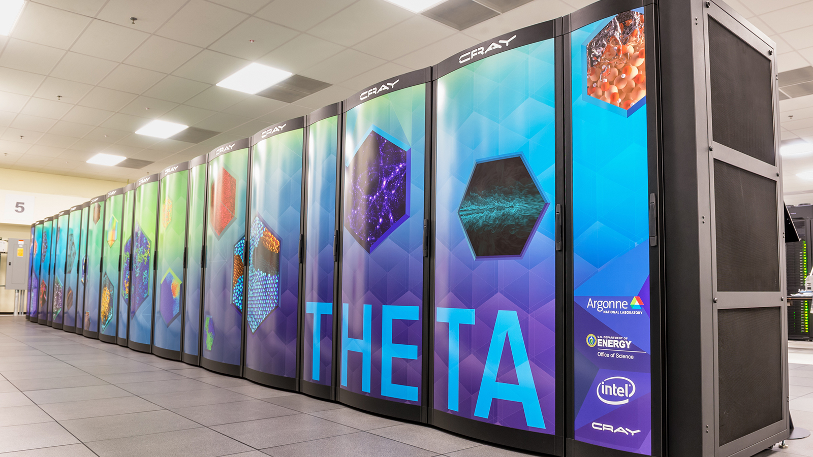
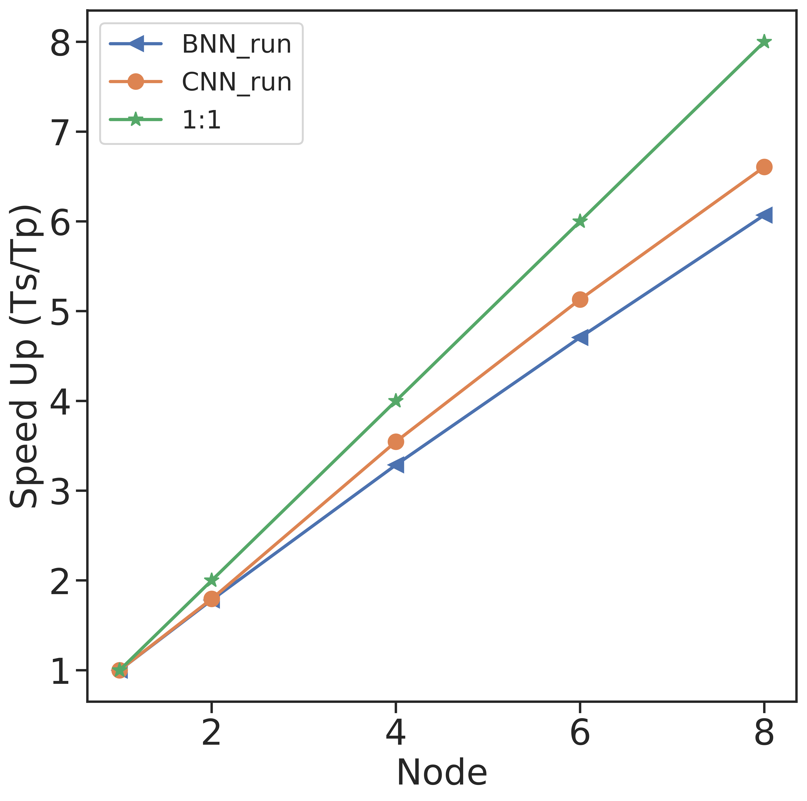
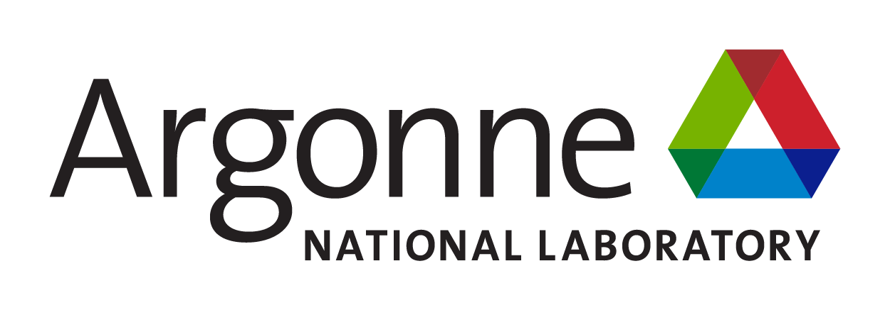

# Bayesian Neural Network (BNN) Distributed Training

[](https://opensource.org/licenses/MIT)

The repo consist codes for preforming distributed training of Bayesian Neural Network models at scale using 
High Performance Computing Cluster such as ALCF (Theta). The main purpose of the code is to act as a tutorial for getting 
started with distibuted training of BNN's on High Performace Computing clusters. In addition, a advanced model is also added 
with the source repository. The advance model is associated with an ADSP project for estimating the the Gravitational Wave parameters 
using combination of Neural Networks and Bayesian Neural Network Layers. The dataset is available on Theta and restricted to the mmadsp users only, 
the code is provided for the purpose of demonstration. For furthter details about [ADSP](https://www.alcf.anl.gov/science/adsp-allocation-program) contact 
Argonne ALCF support.

The BNN models are implemented using the Tensorflow-probability libarary. The data distribted training is performed using Horovod.

## **Brief Background on BNN:**


## **Code Dependencies:**
 + python >= 3.5
 + requirements.txt

## **Dataset:** 
 + [MNIST](http://yann.lecun.com/exdb/mnist/) hand-written digit dataset.


## **Models:** 
  + Bayesian Neural Network with Flipout Fully Connected Layer.('BNN_conv_flip')
  + Bayesian Neural Network with Non-Flipout Fully Connected Layer.('BNN_conv_nonflip')
  + Bayesian Neural Network with Flipout Convolutional Layers.('BNN_FC_flip')
  + Bayesian Neural Network with Non-Flipout Convolutional Layers.('BNN_FC_nonflip)
  + Convolutional Neural Network ('CNN_Conv')
  + Fully Connected Neural Network ('CNN_FC')

## **Files included:**  
  + src/CNN_BNN_Model.py
  + src/utlis.py
  + src/GW_BNN/
  + DATA/mnist.npz
  + BalsamJobCreation/
  + misc/


## **How to run the code:**
   - On the local machine Running:  
        + `horovodrun -n 2 -H localhost:2 python CNN_BNN_Model.py --flagfile=config_file.cfg`

   - ALCF high performance Computing Cluster (Theta) Running: 
    
         
        ```
        PPN=1 # 32,16,8 MPIRank Per Node (Process Per Node)
        NUM_THDS=128

        aprun -n $((${COBALT_PARTSIZE} * ${PPN})) -N ${PPN} -cc depth -j 2 -d ${NUM_THDS} \
            -e OMP_NUM_THREADS=${NUM_THDS} -b python <path to the code>/CNN_BNN_Model.py \
            --flagfile=config_file.cfg
        ```
- Running the job with [Balsam](https://www.alcf.anl.gov/support-center/theta/balsam) (Theta):
    + Look the detail [README.md](BalsamJobCreation/Readme.md)
    
- For other information about the configuration of running the code, use help function as follows;  
`python CNN_BNN_Model.py --help`

        

- **Example Results:**  
    - The comparison of the BNN and CNN time to train with increasing number of nodes are shown in the Fig-1 shown below.
    
    
    - The comparison of the Speed-Up between the BNN and CNN using the training time can be also compared in Fig-2 shown below.   
    

    - The training of the Bayesian Network is to find optimal distribution of the training parameters which done using the technique of Variational Inference(VI). As the training iteration progress the weights posterior converges. An example is shown below with the weights initialized with the Gaussian prior in Fig-3.
    
    
    - As the model is trained the inference is performed by  


- **Research Articles:**
    **Papers related to Bayesian Neural Networks:**
    + [Probabilistic Backpropagation for ScalableLearning of Bayesian Neural Networks](http://proceedings.mlr.press/v37/hernandez-lobatoc15.pdf) 
    + [Weight Uncertainty in Neural Networks](https://arxiv.org/abs/1505.05424)
    + [Practical Variational Inference for Neural Networks](https://papers.nips.cc/paper/4329-practical-variational-inference-for-neural-networks)
    + [A Comprehensive guide to Bayesian Convolutional NeuralNetwork with Variational Inference](https://arxiv.org/pdf/1901.02731.pdf)
    + [Flipout: Efficient Pseudo-Independent Weight Perturbations on Mini-Batches](https://arxiv.org/abs/1803.04386)
    
    **Papers for Gravitational Bayesian Model:**
     + [Deterministic and Bayesian Neural Networks for Low-latency Gravitational Wave Parameter Estimation of Binary Black Hole Mergers](https://arxiv.org/abs/1903.01998)


- **Additional Resources**:
    + [Tensorflow Probalbility Examples](https://github.com/tensorflow/probability/blob/master/tensorflow_probability/examples)


- **Contact**
  + Himanshu Sharma (himanshu90sharma@gmail.com)

- **Ackowledegment** 

     

    This research used resources of the Argonne Leadership Computing Facility, which is a DOE Office of Science User Facility supported under Contract DE-AC02-06CH11357. This research was funded in part and used resources of the Argonne Leadership Computing Facility, which is a DOE Office of Science User Facility supported under Contract DE-AC02-06CH11357. This work describes objective technical results and analysis. Any subjective views or opinions that might be expressed in the work do not necessarily represent the views of the U.S. DOE or the United States Government. Declaration of Interests - None.

